# Art Factory Quick Starter


## Getting Started w/ the Art Factory Gem

Yes, you can!  (Re)use the (pixel) artwork
spritesheets to generate any combination using text-to-image prompts
using the [**Art Factory machinery »**](https://github.com/generativeartfactory/artfactory)


### Collection №1 - Aliens vs Punks


Let's try the Aliens vs Punks - [**aliensvspunks/generate**](aliensvspunks/generate.rb):

``` ruby
require 'artfactory'

# step 1 - setup the art factory;
#    pass-in the spritesheet image & (meta) dataset and
#    the format (e.g. 24x24px)

aliensvsspunks = Artfactory.read( 'aliensvspunks/spritesheet-24x24.png',
                                  'aliensvspunks/spritesheet-24x24.csv',
                                  width: 24,
                                  height: 24)


# step 2 - generate images via text (prompts)

specs = [
  ## no.37
  ['Solid Pink', 'Jacket : Grey', 'Blue Alien Girl', 'Red Kerchief',
   'Blue Buzz Cut', 'Brown', 'Pink Tiara'],
  ## no.28
  ['Solid Blue', 'Olive Guy', 'Orange Collar', 'Face Mask',
   'Yellow Ponytail', 'Green', 'Long Green'],
  ## no.21
  ['Solid Green', 'Jacket : White', 'Purple Alien Girl', 'Pink Collar', 'Neutral',
   'Pink Bob', 'Sunset Shades'],
]


specs.each_with_index do |attributes, i|
   img = aliensvsspunks.generate( *attributes )
   img.save( "aliensvspunks#{i}.png" )
   img.zoom(4).save( "aliensvspunks#{i}@4x.png" )
end
```

Voila!


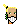
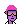

4x:

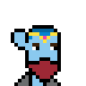

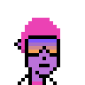


### Collection №2 - Edge Punks


Let's try the Edge Punks  - [**edgepunks/generate**](edgepunks/generate.rb):

``` ruby
edgepunks = Artfactory.read( 'edgepunks/spritesheet-24x24.png',
                             'edgepunks/spritesheet-24x24.csv',
                             width: 24,
                             height: 24)

specs = [
# no.282
  ['Pink', 'Dark Green Lizard', 'Dark Robe', 'Monster Mouth', 'Bat', 'Laser Eyes'],
# no.468
  ['Pink', 'Purple Body', 'Dark Suit', 'Smile', 'Dark Hair', 'Dark Shades'],
# no.678 (1/1)
  ['Anatomy Of An Icon'],
]


specs.each_with_index do |attributes, i|
   img = edgepunks.generate( *attributes )
   img.save( "edgepunks#{i}.png" )
   img.zoom(4).save( "edgepunks#{i}@4x.png" )
end
```

Voila!

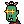
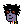
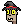

4x:


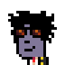
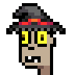


### Collection №3 - Chi Chis

Let's try the Chi Chis - [**chichis/generate**](chichis/generate.rb):

``` ruby
chichis = Artfactory.read( 'chichis/spritesheet-32x32.png',
                           'chichis/spritesheet-32x32.csv',
                             width: 32,
                             height: 32)

specs = [
  ## no.15
  ['Wave', 'Magenta', 'Jersey',  'Lightning Bolt Earrings',
    'Cbd Cig', 'Aviators', 'Beanie'],
  ## no.8
  ['Palms', 'Silver', 'Suit', 'Simple Day', 'Smile', 'Xx', 'Rainbow'],
  ## 1/1
  ['Chichi Phunk'],
]

specs.each_with_index do |attributes, i|
   img = chichis.generate( *attributes )
   img.save( "chichis#{i}.png" )
   img.zoom(4).save( "chichis#{i}@4x.png" )
end
```

Voila!

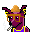

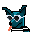

4x:

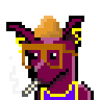
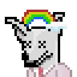


### And Many More Collections

Let's try some more...


**Chopper (in 24×24px)**

Let's try - [**chopper/generate**](chopper/generate.rb):

```
Solid Blue,  Aqua, Hat 22, Smoker, 3D, Banana
Solid Gold, Ap3, Hat Chopper, Non-Smoker, Big Shades, Golden
Solid Black, Midnight, Hat 10, Smoker, Classic Shades, Diamon Cross
```

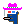


4x:

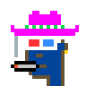
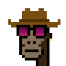
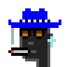


**Dank Punks (in 24×24px)**

Let's try - [**dankpunks/generate**](dankpunks/generate.rb):

```
Night Vibe, Pale, Clown Nose, Red Punk, Green Clown
Contrast, Tan, Black Hair, 3D Glasses
Golden Phunk
```

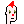
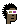


4x:

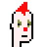
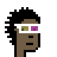
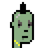


**Fuks (in 24×24px)**

Let's try - [**fuks/generate**](fuks/generate.rb):

```
Robot Fuk, Shaved, Purple Hair, Nose, Vape, VR, No Earrings, Diamond Chain
Undead Fuk, Shaved, Messy Hair, Nose, Smile, Laser, Diamond Stud, Silver Chain
Human Fuk, Chin Strap, Fast Food Cap, Nose, Grin, Nerd Glasses, No Earrings, No Chains
```

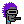
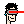
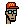

4x:


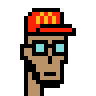


and so on.


## Questions? Comments?

Post them over at the [Help & Support](https://github.com/geraldb/help) page. Thanks.