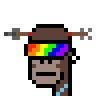

# Art Factory Quick Starter


## Getting Started w/ the Art Factory Gem

Yes, you can!  (Re)use the (pixel) artwork
spritesheets to generate any combination using text-to-image prompts
using the [**Art Factory machinery »**](https://github.com/generativeartfactory/artfactory)


### Collection №1 - Aliens vs Punks


Let's try the Aliens vs Punks - [**aliensvspunks/generate**](aliensvspunks/generate.rb):

``` ruby
require 'artfactory'

# step 1 - setup the art factory;
#    pass-in the spritesheet image & (meta) dataset and
#    the format (e.g. 24x24px)

aliensvsspunks = Artfactory.read( 'aliensvspunks/spritesheet-24x24.png',
                                  'aliensvspunks/spritesheet-24x24.csv',
                                  width: 24,
                                  height: 24)


# step 2 - generate images via text (prompts)

specs = [
  ['Jacket Grey', 'Blue Alien Girl', 'Red Kerchief',
   'Blue Buzz Cut', 'Brown', 'Pink Tiara'],
  ['Olive Guy', 'Orange Collar', 'Face Mask',
   'Yellow Ponytail', 'Green', 'Long Green'],
  [ 'Jacket White', 'Purple Alien Girl', 'Pink Collar', 'Neutral',
   'Pink Bob', 'Sunset Shades'],
]


specs.each_with_index do |attributes, i|
   img = aliensvsspunks.generate( *attributes )
   img.save( "aliensvspunks#{i}.png" )
   img.zoom(4).save( "aliensvspunks#{i}@4x.png" )
end
```

Voila!


4x:


### Collection №2 - Edge Punks


Let's try the Edge Punks  - [**edgepunks/generate**](edgepunks/generate.rb):

``` ruby
edgepunks = Artfactory.read( 'edgepunks/spritesheet-24x24.png',
                             'edgepunks/spritesheet-24x24.csv',
                             width: 24,
                             height: 24)

specs = [
  ['Dark Green Lizard', 'Dark Robe', 'Monster Mouth',
    'Bat', 'Laser Eyes'],
  ['Purple Body', 'Dark Suit', 'Smile', 'Dark Hair', 'Dark Shades'],
  ['Whited Body', 'Monster Mouth', 'Edge Wizard Hat', 'Lizard Eyes'],
]


specs.each_with_index do |attributes, i|
   img = edgepunks.generate( *attributes )
   img.save( "edgepunks#{i}.png" )
   img.zoom(4).save( "edgepunks#{i}@4x.png" )
end
```

Voila!


4x:


### Collection №3 - Chi Chis

Let's try the Chi Chis - [**chichis/generate**](chichis/generate.rb):

``` ruby
chichis = Artfactory.read( 'chichis/spritesheet-32x32.png',
                           'chichis/spritesheet-32x32.csv',
                             width: 32,
                             height: 32)

specs = [
  ['Magenta', 'Jersey',  'Lightning Bolt Earrings',
   'Cbd Cig', 'Aviators', 'Beanie'],
  ['Silver', 'Suit', 'Simple Day', 'Smile', 'Xx', 'Rainbow'],
  ['Deep Teal', 'Stripes', 'Simple Day', 'Tongue Out', 'Cobain, Bald'],
]

specs.each_with_index do |attributes, i|
   img = chichis.generate( *attributes )
   img.save( "chichis#{i}.png" )
   img.zoom(4).save( "chichis#{i}@4x.png" )
end
```

Voila!


4x:


### And Many More Collections

Let's try some more...


#### Chopper (in 24×24px)

Let's try - [**chopper/generate**](chopper/generate.rb):

```
Aqua, Hat 22, Smoker, 3D, Banana
Ap3, Hat Chopper, Non-Smoker, Big Shades, Golden
Midnight, Hat 10, Smoker, Classic Shades, Diamond Cross
```


4x:


#### Dank Punks (in 24×24px)

Let's try - [**dankpunks/generate**](dankpunks/generate.rb):

```
Pale,   Clown Nose, Red Punk, Green Clown
Tan,    Black Hair, 3D Glasses
Zombie, Black Mohawk, Dark Clown, Ok, Jay Z
```


4x:


#### Fuks (in 24×24px)

Let's try - [**fuks/generate**](fuks/generate.rb):

```
Robot Fuk, Shaved, Purple Hair, Nose, Vape, VR, Diamond Chain
Undead Fuk, Shaved, Messy Hair, Nose, Smile, Laser, Diamond Stud, Silver Chain
Human Fuk, Chin Strap, Fast Food Cap, Nose, Grin, Nerd Glasses
```


4x:


#### Inverse Punks (in 24×24px)

Let's try - [**inversepunks/generate**](inversepunks/generate.rb):

```
Alien, Pimple, Cap Forward, Eyes, Bubble Gum, White Gold Chain, Gold Earring
Alien, Clear, Knitted Cap, VR, White Gold Chain, Gold Earring
Ape, Clear, Bandana, Classic Shades, Blue Medical Mask, Pink Sapphire Necklace
```


4x:


#### Mad Camels (in 32×32px)

Let's try - [**madcamels/generate**](madcamels/generate.rb):

```
Zombie, Purple Cap, Earring Gold, Cool Glasses, Bubble Gum
Default, Thief Hat, Green Glasses, Bowtie, Pipe
Alien, Red Cap, Earring Gold, Laser Eye
```


4x:


#### Marcs (in 24×24px)

Let's try - [**marcs/generate**](marcs/generate.rb):

```
Marc 4, Frumpy Hair, Green Shirt, Lasers, Cigarette
Zombie, Green Eyes, Wild Hair, Mustache, Polarized
Alien, Green Eyes, Gold Earring, Crazy Hair, Full Mustache Dark, Horned Rim Glasses
```


4x:


#### NFL (in 23×23px)

Let's try - [**nfl/generate**](nfl/generate.rb):

```
Bot, Oakland, 13, Full Beard Light
Base 5, Atlanta, 7, Full Beard Black
Zombie, Los Angeles 2, 13, Full Beard Brown
```


4x:


#### Nomads (in 24×24px)

Let's try - [**nomads/generate**](nomads/generate.rb):

```
Male 6, Laser, No Really No Mad, Mohawkin
Male 2, Purple, No Really No Mad, Basement Dwellin
Male 4, Purple, I AM NOT F ING MAD, Mohawkin
```


4x:


#### Phunk Ape Origins (in 24×24px)


Let's try - [**phunkapeorigins/generate**](phunkapeorigins/generate.rb):

```
Chimpanzee 1, Arrow, Snow Visor, Tooth Plug, Diamond Chain
Silver Back, Wild Monkey Hair, Focused, Silver Dangle, Gold Chain, Cigar
Yeti, Royal Crown, Matrix Shades, Silver Stud, Tooth Necklace, Tooth
```


4x:




#### Punk Apes Yacht Club (in 24×24px)

Let's try - [**punkapesyachtclub/generate**](punkapesyachtclub/generate.rb):

```
Black, Prison Jumpsuit, Top Hat, Green Eye Shadow, Cigarette With Hot Lipstick, Silver Loop
Trippy, Biker Vest, Silver Chain, Pink With Hat, Clown Eyes Green, Frown, Silver Stud
Zombie, Tanktop, Orange Side, 3D Glasses, Frown
```


4x:


and so on.


## Questions? Comments?

Post them over at the [Help & Support](https://github.com/geraldb/help) page. Thanks.
